# Architecture Document: Copilot SDK Work IQ Integration

## System Overview

```mermaid
flowchart TB
    subgraph UI["🖥️ User Interface"]
        WebApp["News Aggregator Web App<br/><i>index.html - Modern Dark UI with SSE</i>"]
    end

    subgraph Server["⚙️ Express.js Server"]
        ServerTS["server.ts (Port 3000)"]
        subgraph Endpoints[" "]
            SSE["GET /api/news-stream<br/>(SSE)"]
            Legacy["GET /api/news<br/>(Legacy)"]
            Summarize["POST /api/<br/>summarize-topic"]
        end
    end

    subgraph SDK["🤖 GitHub Copilot SDK Layer"]
        Client["CopilotClient (Singleton)"]
        subgraph Features[" "]
            Session["Session Mgmt"]
            Streaming["Streaming Events"]
            MCP["MCP Server Integration"]
        end
    end

    subgraph WorkIQ["📡 MCP Server: Work IQ"]
        NPX["npx -y @microsoft/workiq mcp"]
        AskWorkIQ["mcp_workiq_ask_work_iq<br/><i>Microsoft 365 Data Access</i>"]
    end

    subgraph M365["☁️ Microsoft 365 Backend"]
        Emails["📧 Emails<br/>(Inbox/news)"]
        Calendar["📅 Calendar<br/>(Meetings)"]
        Files["📁 Files<br/>(OneDrive)"]
    end

    UI --> Server
    Server --> SDK
    SDK --> WorkIQ
    WorkIQ --> M365
```



---

## Components

### 1. Frontend: News Aggregator Web App

| Aspect | Details |
|--------|---------|
| **Location** | `src/news-app/public/index.html` |
| **Technology** | Vanilla JavaScript, CSS3, HTML5 |
| **Design** | Modern dark theme with gradient accents |
| **Communication** | Server-Sent Events (SSE) for real-time updates |

**Features:**
- Real-time streaming status updates during news fetch
- Filter controls (days, max items, duplicate handling)
- Interactive news cards with source badges
- Live progress indicators and statistics

### 2. Backend: Express.js Server

| Aspect | Details |
|--------|---------|
| **Location** | `src/news-app/server.ts` |
| **Runtime** | Node.js with ESM modules |
| **Framework** | Express.js v4 |
| **Port** | 3000 (configurable via `PORT` env) |

**API Endpoints:**

| Endpoint | Method | Purpose |
|----------|--------|---------|
| `/api/news-stream` | GET | SSE endpoint for streaming news aggregation |
| `/api/news` | GET | Legacy JSON endpoint for news fetch |
| `/api/summarize-topic` | POST | Topic-specific summarization |

### 3. Copilot SDK Integration

| Aspect | Details |
|--------|---------|
| **Package** | `@github/copilot-sdk` |
| **Pattern** | Singleton CopilotClient with session management |
| **Models** | `gpt-5-mini`, `gpt-4.1`, `gpt-4.1-mini` |

**Key Features:**
- Streaming event handling (`SessionEvent`)
- MCP server integration for Work IQ
- Session lifecycle management (create → use → destroy)

### 4. CLI Agent

| Aspect | Details |
|--------|---------|
| **Location** | `src/agent.ts` |
| **Purpose** | Interactive CLI for Work IQ queries |
| **Custom Tools** | `get_secret_number`, `get_current_time` |

---

## Data Flow: News Aggregation Pipeline

```mermaid
flowchart TB
    subgraph Step1["📥 STEP 1: FETCH EMAILS (Parallel)"]
        direction TB
        Day1["Day 1<br/>Emails"]
        Day2["Day 2<br/>Emails"]
        DayN["Day N<br/>Emails"]
        Day1 & Day2 & DayN --> |"Parallel API calls<br/>to Work IQ"| RawEmails["RawEmail[]<br/><i>id, subject, sender, date, emailUrl, source</i>"]
    end

    subgraph Step2["📝 STEP 2: EXTRACT & SUMMARIZE (Parallel Batches)"]
        direction TB
        Batch1["Batch 1<br/>(5 emails)"]
        Batch2["Batch 2<br/>(5 emails)"]
        BatchN["Batch N<br/>(5 emails)"]
        Batch1 & Batch2 & BatchN --> Split["Split newsletters into individual stories<br/>Generate 3-5 sentence summaries"]
        Split --> NewsItems["NewsItem[]<br/><i>id, subject, sender, date, summary, source, emailUrl</i>"]
    end

    subgraph Step3["🔀 STEP 3: MERGE DUPLICATES (Parallel)"]
        direction TB
        Similarity["Word-based Similarity Detection<br/><i>Group items with ≥2 common significant words</i>"]
        Single["Single Item<br/>(Pass-thru)"]
        Group1["Duplicate<br/>Group 1"]
        GroupN["Duplicate<br/>Group N"]
        Similarity --> Single
        Similarity --> Group1
        Similarity --> GroupN
        Group1 & GroupN --> LLM["LLM Merge:<br/>Unified headline + Combined summary"]
        Single & LLM --> Merged["MergedNewsItem[]<br/><i>id, subject, date, summary, sources[], emailUrls[]</i>"]
    end

    Step1 --> Step2
    Step2 --> Step3
```



---

## Key Design Decisions

### ADR-001: Server-Sent Events for Real-time Updates

**Status**: Accepted

**Context**: Users need to see progress during the multi-step news aggregation process which can take 30-60 seconds.

**Decision**: Use SSE (Server-Sent Events) instead of WebSockets or polling.

**Consequences**:
- ✅ Simple implementation with native browser support
- ✅ Unidirectional data flow fits the use case
- ✅ Auto-reconnection built into EventSource API
- ⚠️ Limited to text-based events

---

### ADR-002: Parallel Processing Pipeline

**Status**: Accepted

**Context**: Fetching and processing emails sequentially was too slow (2-3 minutes).

**Decision**: Implement parallel processing at each stage:
- Fetch all days in parallel
- Process email batches in parallel
- Merge duplicate groups in parallel

**Consequences**:
- ✅ Reduced total processing time by ~60%
- ✅ Better utilization of API rate limits
- ⚠️ Increased complexity in error handling
- ⚠️ Higher memory usage during parallel operations

---

### ADR-003: Singleton CopilotClient Pattern

**Status**: Accepted

**Context**: Creating CopilotClient instances is expensive and should be reused.

**Decision**: Use lazy initialization singleton pattern via `getClient()` function.

**Consequences**:
- ✅ Single connection managed efficiently
- ✅ Proper lifecycle management with graceful shutdown
- ⚠️ Sessions must be explicitly destroyed after use

---

### ADR-004: MCP Local Server for Work IQ

**Status**: Accepted

**Context**: Need to access Microsoft 365 data through Work IQ.

**Decision**: Use local MCP server spawned via `npx -y @microsoft/workiq mcp`.

**Consequences**:
- ✅ Access to emails, calendar, files
- ✅ Secure OAuth-based authentication
- ⚠️ Requires user consent for EULA
- ⚠️ Network latency for M365 API calls

---

## Type Definitions

```typescript
// Raw email metadata from Work IQ
interface RawEmail {
    id: string;
    subject: string;
    sender: string;
    date: string;
    emailUrl: string;
    source: string;
}

// Individual news story with summary
interface NewsItem {
    id: string;
    subject: string;
    sender: string;
    date: string;
    summary: string;
    source: string;
    emailUrl: string;
    originalEmailId?: string;
}

// Merged news item combining duplicate stories
interface MergedNewsItem {
    id: string;
    subject: string;
    date: string;
    summary: string;
    sources: string[];       // Multiple sources
    emailUrls: string[];     // Multiple email links
    originalItems: NewsItem[];
}
```

---

## Dependencies

| Package | Version | Purpose |
|---------|---------|---------|
| `@github/copilot-sdk` | latest | GitHub Copilot AI integration |
| `express` | ^4.22.1 | Web server framework |
| `zod` | ^3.24.0 | Schema validation |
| `tsx` | ^4.7.0 | TypeScript execution (dev) |
| `vitest` | ^4.0.18 | Testing framework (dev) |

---

## Configuration

### Environment Variables

| Variable | Default | Description |
|----------|---------|-------------|
| `PORT` | 3000 | Server port |

### NPM Scripts

| Script | Command | Description |
|--------|---------|-------------|
| `npm run news` | `npx tsx src/news-app/server.ts` | Start news aggregator |
| `npm run agent` | `npx tsx src/agent.ts` | Start CLI agent |
| `npm test` | `vitest run` | Run tests |

---

## Security Considerations

1. **Authentication**: Work IQ uses OAuth through Microsoft identity
2. **EULA Acceptance**: Required before accessing M365 data
3. **Graceful Shutdown**: SIGINT handler ensures clean client disconnection
4. **No Credential Storage**: All auth handled by Work IQ MCP server

---

## Future Considerations

1. **Caching Layer**: Cache email fetches to reduce API calls
2. **Incremental Updates**: Only fetch new emails since last check
3. **Offline Support**: Service worker for cached news viewing
4. **Push Notifications**: Alert users of breaking news
5. **Multi-tenant**: Support for multiple M365 accounts
